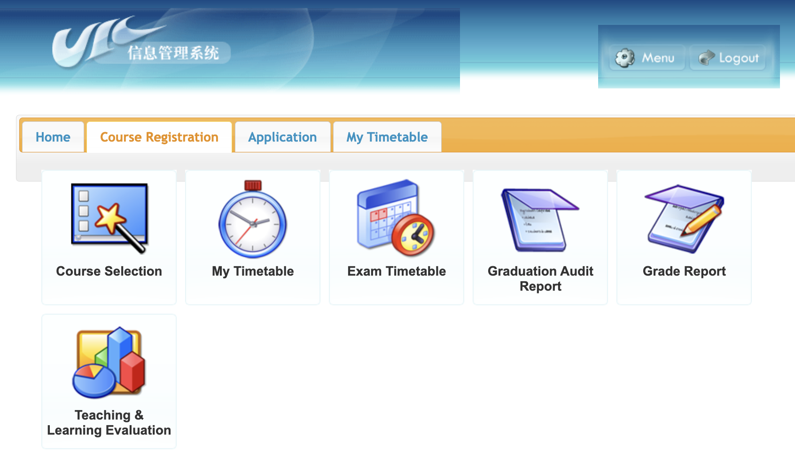
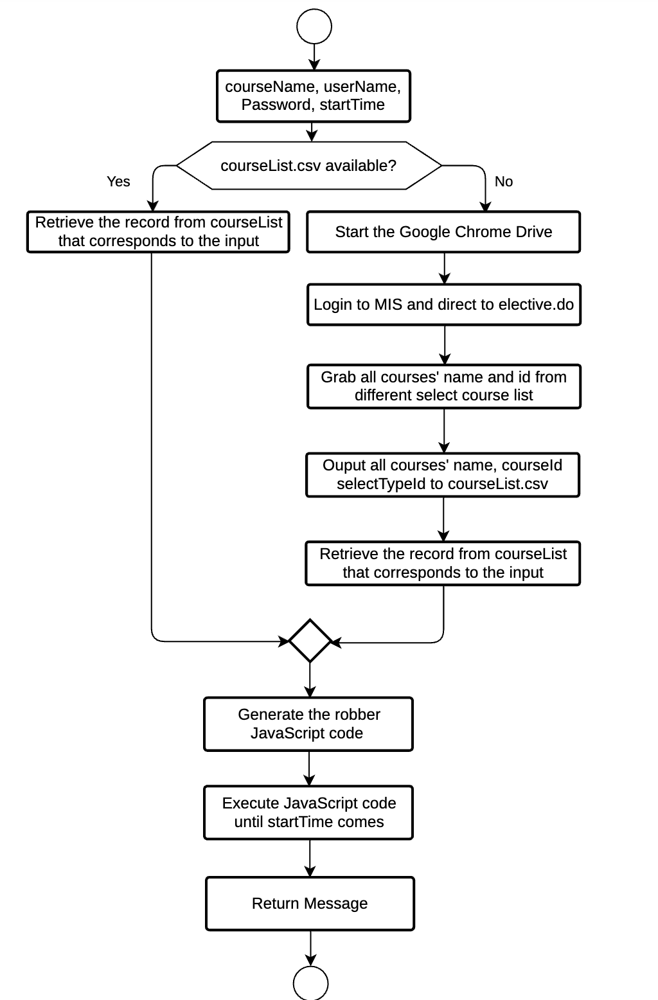
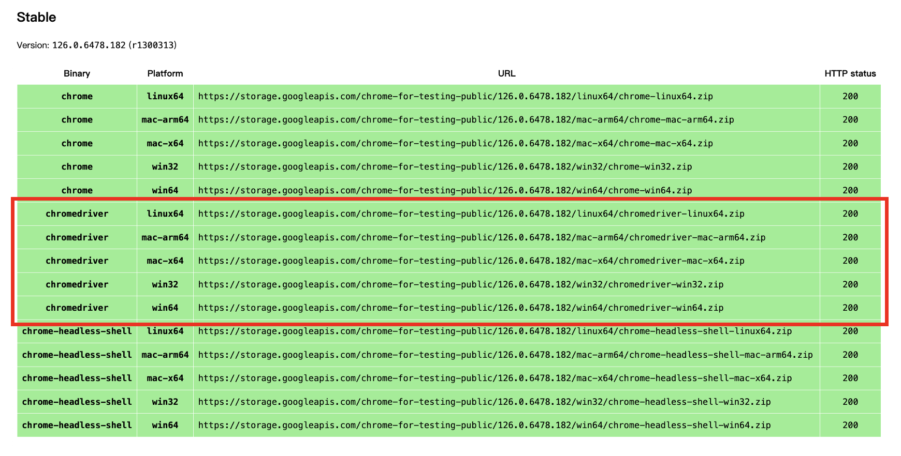

# 🥷 _MIS-ROBBER_ UIC北师港浸大自动化抢课程序

### BNU-HKBU UIC 2024 Automated Courses Robberies

## ⚠️ 免责声明 | Disclaimer

**⚠️ UIC选课规则 Course Selection Rules：** Please note that students are **NOT** allowed to use any third-party software for the course selection exercise at any time. Any such case, once discovered, should be promptly reported to the Student Discipline Committee, and it may be subject to penalties. 请注意，学生在任何时候都**不得**使用任何第三方软件进行选课。一旦发现此类情况，应立即向学生纪律委员会报告，并可能会受到处罚。

**⛔️一旦下载并使用此程序，即表示您同意以下条款。任何使用本程序所产生的后果均由使用者自行承担。**
**By downloading and using this software, you agree to the following terms. Any consequences arising from the use of this software will be the sole responsibility of the user.**

### 🇨🇳 中文：
本程序仅供学习和研究技术使用，使用者需自行承担因使用本脚本可能带来的任何后果。作者不对因使用本程序而引发的任何直接或间接损失负责。请在使用前确保遵守UIC，UIC SAO (Student Affair Office)，UIC AR (Academic Registry)以及各个学部/专业的相关规定和政策，不得将本程序用于任何非法或不正当目的。

#### 使用限制：
1. **🏦 非商业使用**：本程序仅限于个人学习和研究使用，禁止用于任何商业目的。
2. **⚖️ 遵守法规**：使用者必须遵守相关法律法规和学校的规定，不得利用本程序从事任何非法活动。
3. **💻 禁止分发**：未经作者书面许可，禁止复制、修改、分发或出售本程序的任何部分。
4. **🙅 责任声明**：使用者需对因使用本程序所导致的任何后果，包括但不限于数据丢失、系统故障、或其他损失自行负责。

#### 技术支持：
如有任何疑问或顾虑，请咨询相关专业人士、技术支持以及学校方面。

### 🇺🇸 English :
This programme is intended for study and research purposes only and the user is solely responsible for any consequences that may arise from the use of this script. The author is not responsible for any direct or indirect damages arising from the use of this programme. Please ensure that you comply with UIC, UIC SAO (Student Affair Office), UIC AR (Academic Registry), and individual departmental/programme regulations and policies before use, and do not use this program for any illegal or improper purpose.

#### Usage Restrictions:
1. **🏦 Non-commercial Use**: This software is intended for personal study and research purposes only and is not to be used for any commercial purposes.
2. **⚖️ Compliance with Regulations**: Users must comply with relevant laws, regulations, and university policies, and must not use this software for any illegal activities.
3. **💻 Prohibition of Distribution**: Without the written permission of the author, copying, modifying, distributing, or selling any part of this software is prohibited.
4. **🙅 Disclaimer of Liability**: Users are responsible for any consequences resulting from the use of this software, including but not limited to data loss, system failures, or other damages.

#### Technical Support:
If you have any questions or concerns, please consult with the appropriate professionals, technical support, and the university.

### 📖 License
This project is licensed under the Apache License 2.0 - see the [LICENSE](LICENSE) file for details.

## 📖 简介 | Introduction
该程序用于从UIC的MIS选课系统抓取课程信息，并在指定时间自动抢下你提供的课程（根据你想抢的课程名）。程序使用 Selenium 和 BeautifulSoup 库来实现登录、抓取和自动选课功能。
This program is used to grab course information from UIC's MIS course selection system and automatically select a course at a specified time. The program uses Selenium and BeautifulSoup libraries to implement the login, grabbing and automatic course selection functions.

## 🧑‍🏫 使用教程 | Tutorial

### 1. 下载Chrome和ChromeDriver
首先确认您的计算机中是否安装了Chrome，并更新到最新版本，如果没有请前往 [Chrome中国 官网](https://www.google.cn/intl/zh-CN/chrome/) 下载并安装Google Chrome。

接着前往[Chrome Driver官网](https://googlechromelabs.github.io/chrome-for-testing/) 下载最新版本与你的电脑系统相对应的Chrome Driver。如红框所示的位置。

下载完成后解压，把chromedriver程序放到chromedriver目录下。

### 2. 运行main_menu.py
运行前请确保你的电脑中安装了python3.8版本，以及所有的依赖包。
