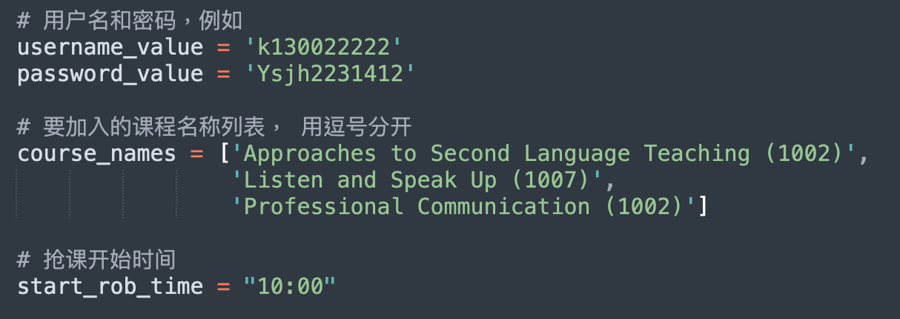

# 🥷 MIS-ROBBER
## UIC北师港浸大 2024 MIS系统高级自动化抢课程序

## ⚠️ 免责声明

1️⃣ **中文 🇨🇳：** 本程序仅供学习和研究技术使用，使用者需自行承担因使用本脚本可能带来的任何后果。作者不对因使用本程序而引发的任何直接或间接损失负责。请在使用前确保遵守UIC，UIC SAO (Student Affair Office)，UIC AR (Academic Registry)以及各个学部/专业的相关规定和政策，不得将本程序用于任何非法或不正当目的。如有任何疑问或顾虑，请咨询相关专业人士，技术支持以及学校方面。 **English 🇺🇸 :** This programme is intended for study and research techniques only and the user is solely responsible for any consequences that may arise from the use of this script. The author is not responsible for any direct or indirect damages arising from the use of this programme. Please ensure that you comply with UIC, UIC SAO (Student Affair Office), UIC AR (Academic Registry), and individual departmental/programme regulations and policies before use, and do not use this program for any illegal or improper purpose. If you have any questions or concerns, please consult with the appropriate professionals, technical support, and the university.

2️⃣ **UIC选课规则 Course Selection Rules：** Please note that students are **NOT** allowed to use any third-party software for the course selection exercise at any time. Any such case, once discovered, should be promptly reported to the Student Discipline Committee, and it may be subject to penalties. 请注意，学生在任何时候都**不得**使用任何第三方软件进行选课。一旦发现此类情况，应立即向学生纪律委员会报告，并可能会受到处罚。


## 📖 简介
该Python脚本用于从UIC的MIS选课系统抓取课程信息，并在指定时间自动选择课程。脚本使用 Selenium 和 BeautifulSoup 库来实现登录、抓取和自动选课功能。


## 🧑‍🏫 使用教程

### 1. 安装 Python
如果您的计算机上还没有安装 Python，请前往 [Python 官网](https://www.python.org/downloads/) 下载并安装 Python 3.8版本。更加详细的教程建议前往百度，谷歌，B站或者Youtube寻找，在这里不进行过多赘述。
```sh
python --version
```

运行命令查看是否安装成功。

### 2. 安装必要的 Python 库
在终端或命令行中运行以下命令来安装必要的库：
```sh
pip install pandas beautifulsoup4 selenium
```
或者
```sh
conda install pandas beautifulsoup4 selenium
```

### 3. 下载Chrome和ChromeDriver
首先确认您的计算机中是否安装了Chrome，并更新到最新版本，如果没有请前往 [Chrome中国 官网](https://www.google.cn/intl/zh-CN/chrome/) 下载并安装Google Chrome。

接着前往[Chrome Driver官网](https://googlechromelabs.github.io/chrome-for-testing/) 下载最新版本与你的电脑系统相对应的Chrome Driver。如红框所示的位置。


下载完成后解压，把chromedriver程序放到chromedriver目录下

## 💻 配置参数
在 START_ROBBER.py 中配置以下参数：
- username_value：MIS登录用户名，例如 's130027654'。
- password_value：MIS登录密码，例如 'Syuh287812'。
- course_names：要加入的课程名称列表（注意有空格和班级，请直接在MIS系统中复制过来），例如 ['Big Data Analysis and Applications (1002)', 'Introduction to Bioinformatics (1002)']。
- start_rob_time：开始选课的时间，例如 "10:00"。



## 🏃 运行MIS_ROBBER抢课程序
以上环境/参数配置完成后可以使用以下代码运行程序
```shell
python START_ROBBER.py
```